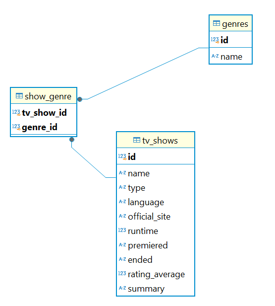
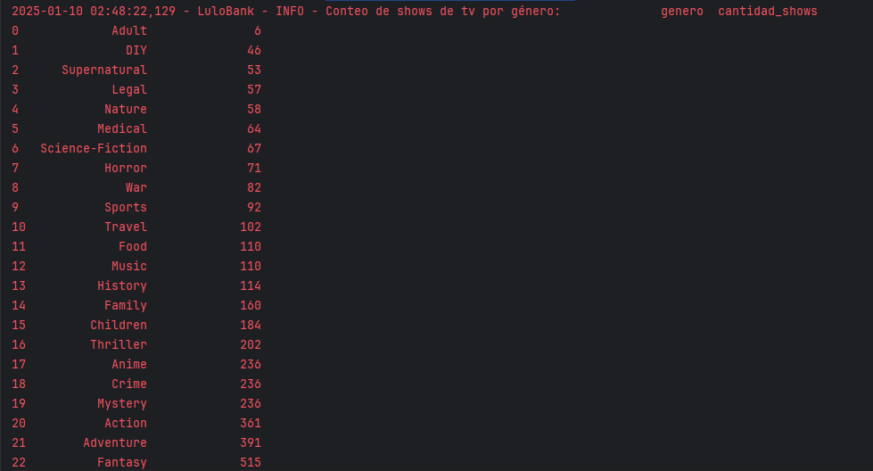
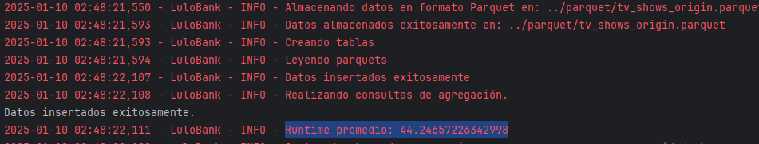
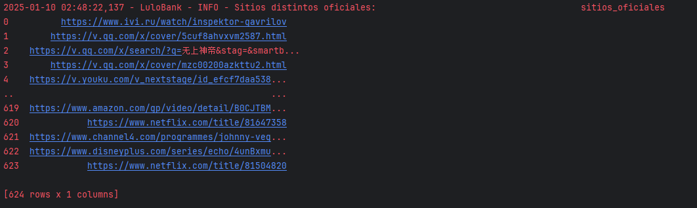

# Tv Shows

## Este repositorio contiene la solución a la prueba de Data Enginner para LuloBank.

Para generar los resultados expuestos aquí, se debe clonar el repositorio:

`git https://github.com/jdrincone/lulobank.git`

Crear un entorno virtual e installar los requerimientos

 `pip install -r requeriments.txt`

Paso siguiente, se puede ejecutar el script `python main.py`,
el cual activa todo el pipeline del proyecto en el siguiente orden:

- Se consulta el endpoint: http://api.tvmaze.com/schedule/web?date={fecha},
  donde la fecha toma los valores del mes de enero del 2024.
- La información obtenida se almacenará en formato `\json` con nombre json\series_{fecha}, luego, los datos
  son cargados en un dataframe, normalizando el json, con el dataframe construido (que contiene todas las series de tv 
  de enero de 2024) se procede a realizar un profit del dataframe para tener una visión descriptiva del contenido de
  este, ver forder `\profiling`, donde se encontrará un archivo `.html` (ideal hostearlo en S3) y un PDF con un pequeño 
  análisis descriptivo del las variables que contiene la tabla. Con ello, limpiaremos y modelaremos
  los datos para ser almacenados en `.parquet` comprimidos en `SNAPY` y luego cargados a una base de
  datos segun el modelo de entidad relación expuesto de `\figure`.
- Modelo de datos:

- Por último, se crea el modelo de datos con un ORM y se llenan las tablas con los parquets almacenados.
 Con los datos en la BD se puede realizar algunas consultas como:
  a. Runtime promedio (averageRuntime).
  b. Conteo de shows de tv por género.
   c. Listar los dominios únicos (web) del sitio oficial de los shows.

- Por ultimo, se generan algunos test unitarios de funciones 
  del core del proyecto, estos podran ejecutarsen con:

`pytest .\test\test_buil_pipeline.py`
